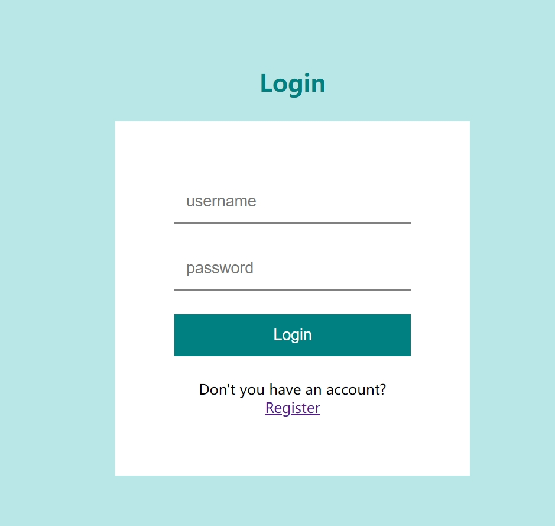
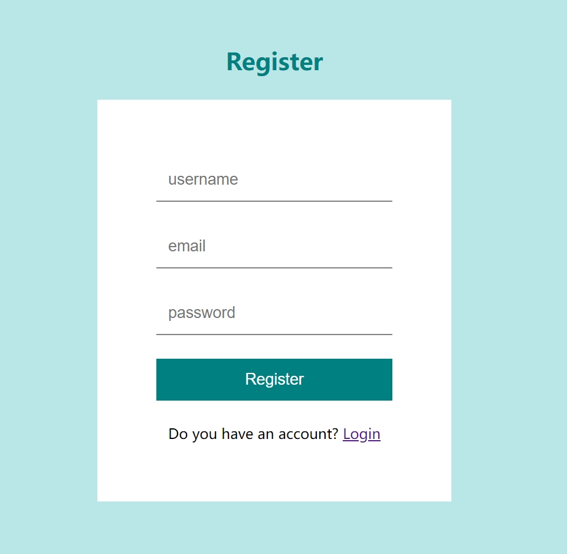
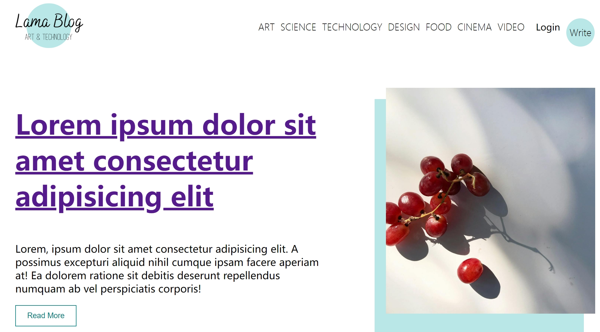
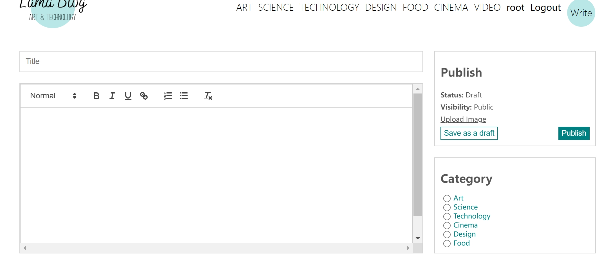
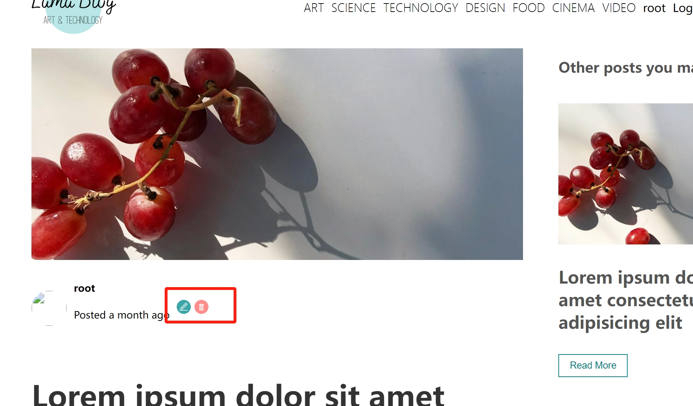

# Blog + WebVideo
### 实现的功能
1. 用户登入与注册<br>
 
2. 用户浏览不同种类的post(post进行分类)<br>

3. 用户只有在登入的情况下才可以Write post并publish<br>

4. 用户只可以在登入情况下编辑和删除自己发布的post<br>

5. Video为新增选项，可以浏览服务器本地指定视频资源目录的层级情况,并播放对应视频

### usage

``` shell
1. > git clone git@github.com:jingtao8a/webvideo.git

2. > git checkout webvideo

3. 安装ffmpeg和Tomcat容器

4. 安装mysql,并且使用webvideo.sql初始化

5. 修改VideoController.mp4VideoRootPath的路径为本地视频所在路径

6. 配置idea run

```


### 待解决问题
- [x] 1.ffmpeg分片问题，有的视频分片会减少视频时长，有的只会得到音频信息
- [] 2.多用户访问时的竞争条件
- [] 3.请求的是图片时,直接返回

***
- 前端项目地址:[webvideo_react](https://github.com/jingtao8a/webvideo_react/tree/webvideo) webvideo分支
- 前端项目参考视频:[使用React构建博客应用程序](https://www.bilibili.com/video/BV1Zg411Y7fb/?spm_id_from=333.337.search-card.all.click&vd_source=1c0783715047ed7b57030c61edf89d7b)
